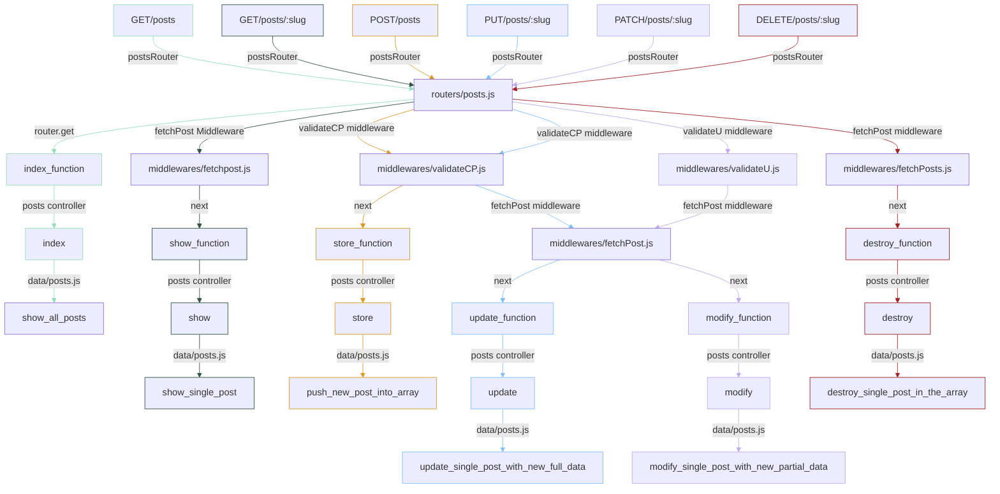

```mermaid
flowchart TD
A[GET/posts] --> |postsRouter| routers/posts.js --> |router.get| C[index_function] --> |posts controller| D[index] --> |data/posts.js| show_all_posts
linkStyle 0 stroke:#95DEB9
linkStyle 1 stroke:#95DEB9
linkStyle 2 stroke:#95DEB9
linkStyle 3 stroke:#95DEB9

E[GET/posts/:slug] --> |postsRouter| routers/posts.js --> |fetchPost Middleware| middlewares/fetchpost.js --> |next| H[show_function] --> |posts controller| I[show] --> |data/posts.js| J[show_single_post]
linkStyle 4 stroke:#31543F
linkStyle 5 stroke:#31543F
linkStyle 6 stroke:#31543F
linkStyle 7 stroke:#31543F
linkStyle 8 stroke:#31543F

K[POST/posts] --> |postsRouter| routers/posts.js --> |validateCP middleware| middlewares/validateCP.js --> |next| N[store_function] --> |posts controller| O[store] --> |data/posts.js| P[push_new_post_into_array]
linkStyle 9 stroke:#DB9821
linkStyle 10 stroke:#DB9821
linkStyle 11 stroke:#DB9821
linkStyle 12 stroke:#DB9821
linkStyle 13 stroke:#DB9821

Q[PUT/posts/:slug] --> |postsRouter| routers/posts.js --> |validateCP middleware| middlewares/validateCP.js --> |fetchPost middleware| middlewares/fetchPost.js --> |next| U[update_function] --> |posts controller| V[update] --> |data/posts.js| W[update_single_post_with_new_full_data]
linkStyle 14 stroke:#7FC0FA
linkStyle 15 stroke:#7FC0FA
linkStyle 16 stroke:#7FC0FA
linkStyle 17 stroke:#7FC0FA
linkStyle 18 stroke:#7FC0FA
linkStyle 19 stroke:#7FC0FA

X[PATCH/posts/:slug] --> |postsRouter| routers/posts.js --> |validateU middleware| Z[middlewares/validateU.js] --> |fetchPost middleware| middlewares/fetchPost.js --> |next| AB[modify_function] --> |posts controller| AC[modify] --> |data/posts.js| AD[modify_single_post_with_new_partial_data]
linkStyle 20 stroke:#C1A9EE
linkStyle 21 stroke:#C1A9EE
linkStyle 22 stroke:#C1A9EE
linkStyle 23 stroke:#C1A9EE
linkStyle 24 stroke:#C1A9EE
linkStyle 25 stroke:#C1A9EE

AE[DELETE/posts/:slug] --> |postsRouter| routers/posts.js --> |fetchPost middleware| middlewares/fetchPosts.js --> |next| AH[destroy_function] --> |posts controller| AI[destroy] --> |data/posts.js| AJ[destroy_single_post_in_the_array]
linkStyle 26 stroke:#A52121
linkStyle 27 stroke:#A52121
linkStyle 28 stroke:#A52121
linkStyle 29 stroke:#A52121
linkStyle 30 stroke:#A52121


classDef index border:#95DEB9, stroke:#95DEB9
class A,B,C,D index;
classDef show border:#31543F,stroke:#31543F
class E,F,G,H,I,J show;
classDef post border:#DB9821,stroke:#DB9821
class K,L,M,N,O,P post;
classDef update border:#7FC0FA,stroke:#7FC0FA
class Q,R,S,T,U,V,W update;
classDef modify border:#C1A9EE,stroke:#C1A9EE
class X,Y,Z,AA,AB,AC,AD modify;
classDef destroy border:#A52121,stroke:#A52121
class AE,AF,AG,AH,AI,AJ destroy;
```